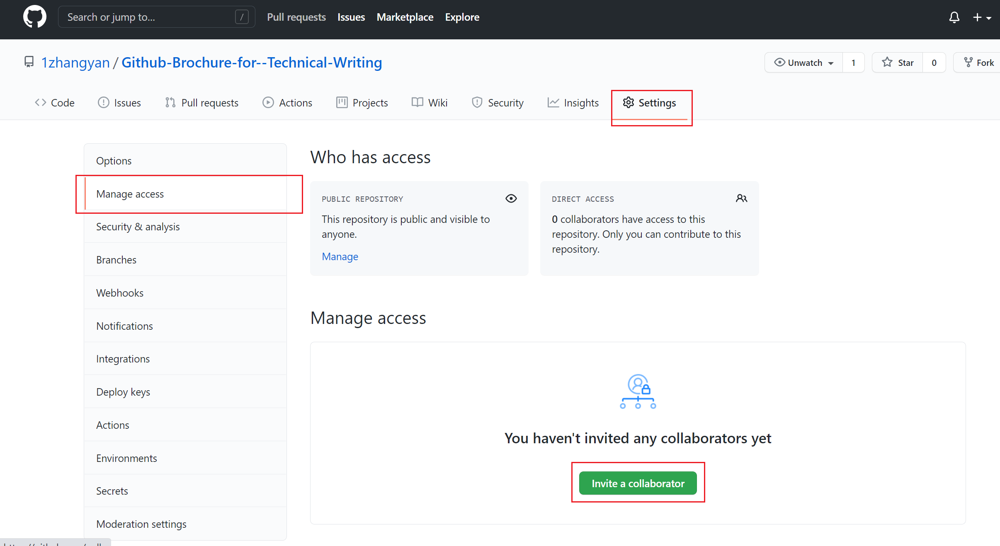

# GitHub多人协作
## 邀请你的队友 
传统的文档协作过程中，可能在任务分配后每个人完成不同的任务，最后再通过拷贝文件或者网络传输到一台机器上进行汇总。    
GitHub不希望你做的这么麻烦，他允许你和你的队友们将仓库克隆到自己本机，进行修改后再将各自的工作推送到远程仓库。  
最终在远程仓库中讲你们的工作合并。  
那么首先，你得需要队友。  

选中GitHub仓库，点击setting选项卡，再选中ManageAccess选项，打开后点击invite a collabrator，添加你的队友。  

## 再谈分支
我们知道我们的提交默认都提交到了main分支上。当我们多个人协作的时候，无法保证每个人每时每刻的本地内容和远程内容都相同，这就使得如果使用单一的main分支，每次提交之前需要将远程的内容同步到本地。如果操作不当，本地的修改可能被覆盖。同时这样每次提交都需要考虑这些内容，就会使协作多出很多不必要的麻烦。  
但是如果每个人都建立一个分支呢？你和你的队友们各自在各自的分支上工作，保证不动别人的分支，你们只管负责自己的部分，等到所有人都结束整个项目后，再把所有的分支都汇总到一起，汇总到一个分支上来，是不是就极大地减少了合作期间的交流成本？  

## 克隆仓库并新建分支  
在第三章中创建远程仓库并从本地克隆这一小节中，我们学习了如何把远程的仓库克隆到本地。

## 合并分支