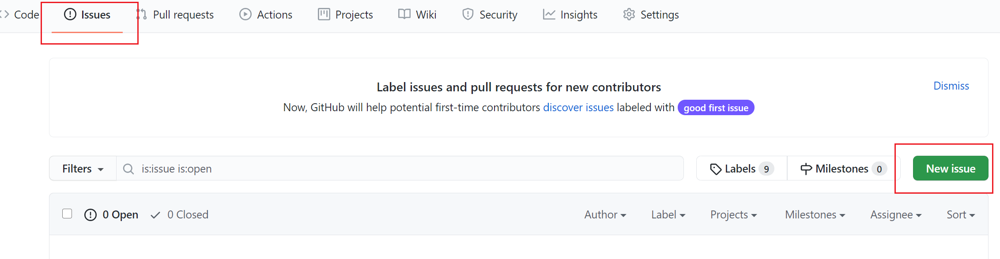

# Chapter6 Issue和Wiki的使用
## Issue
当我们发现仓库中的代码有什么疏漏或者错误的时候，我们可以提Issue，帮助小组或者自己记录要解决的问题。  
在仓库的Issue选项卡中，找到New Issue按钮  
   
按照指示填写具体的Issue内容   
   
这样在Issue列表中就出现了需要解决的Issue，我们可以将它分配给小组成员或者自己解决，直到最后关闭这个Issue。  
  
解决后关闭Issue  

## Wiki
当我们有知识或者任何有价值的事情值得分享的时候，可以创建Wiki页面。  
  
我们把希望分享的内容记录后保存这个Wiki。  
这样所有人都可以看到Wiki的内容。  
  
